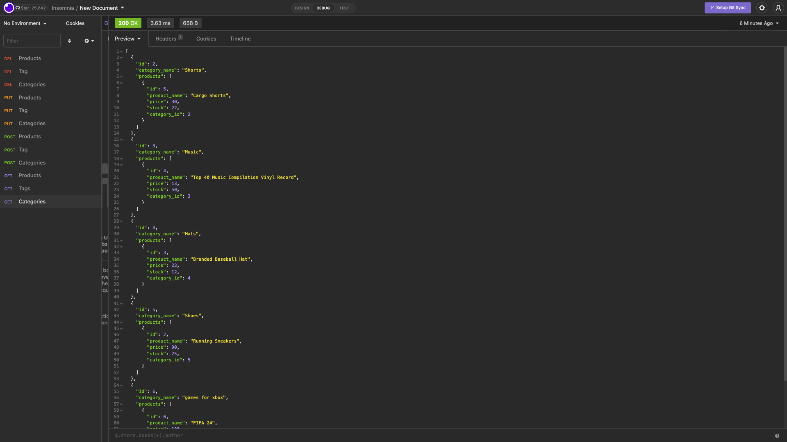

# 🛒 E-commerce Back-End
This is a CRUD e-commerce template backend that allows a basic nesting of objects created to call on APIs for later use and or the eventual building of a front end enviornment.

## 🛠 Tools

- Expresss
- Mysql2
- Sequelize
- Dotenv

## 📸 Screen Shots


## 💻 Installation

To install dependencies follow this commands on the root file:

```
npm install -y
```

```
npm i express mysql2 sequelize dotenv
```

## Author

- [@Johanh0](https://www.github.com/johanh0)


## Support or contact

For support or if you wish contact me please, email me to [johanherrera20000@gmail.com](mailto:johanherrera20000@gmail.com).